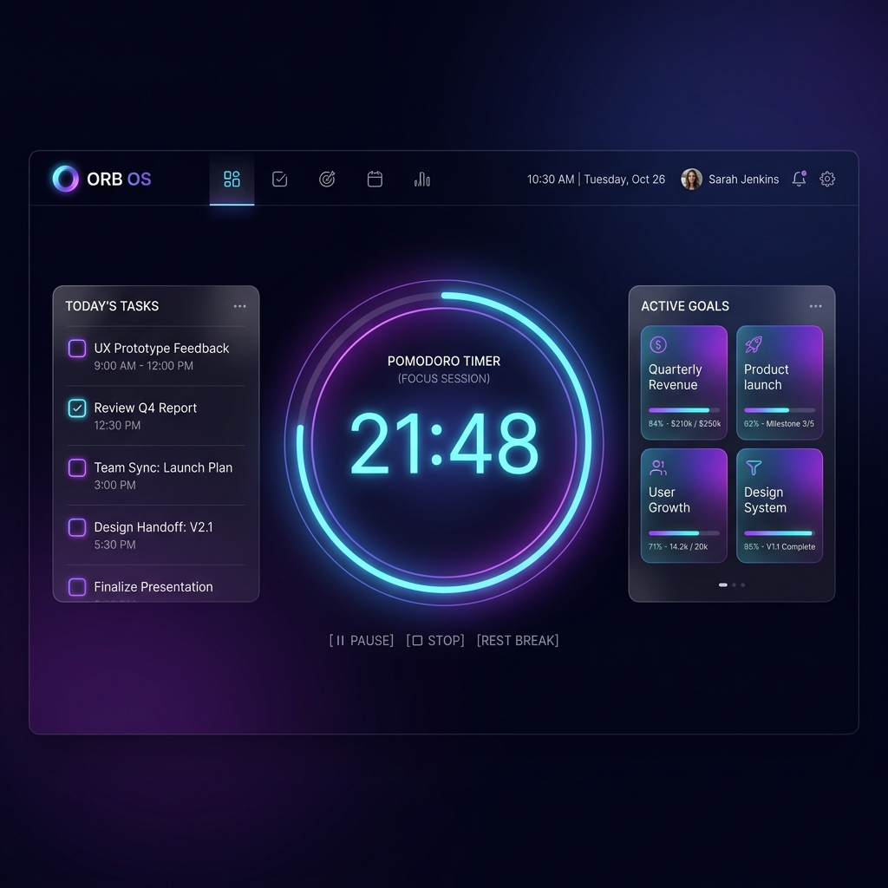
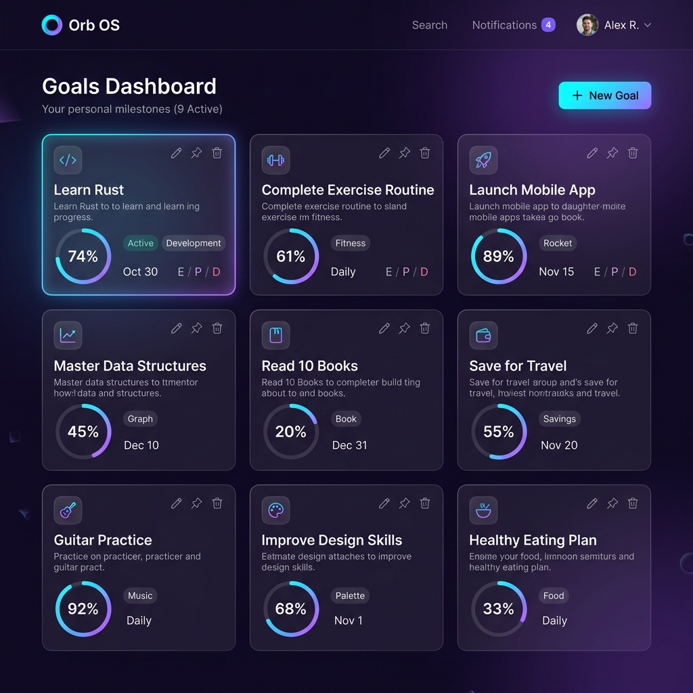
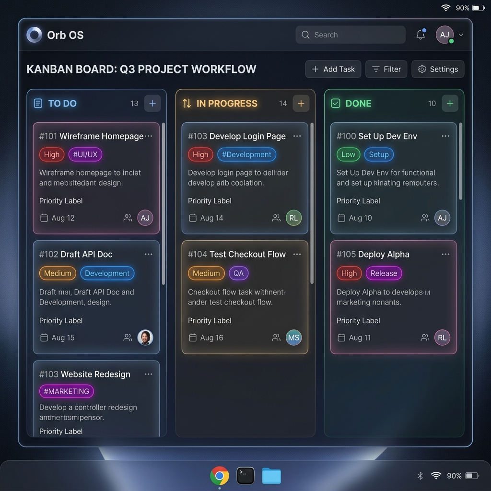
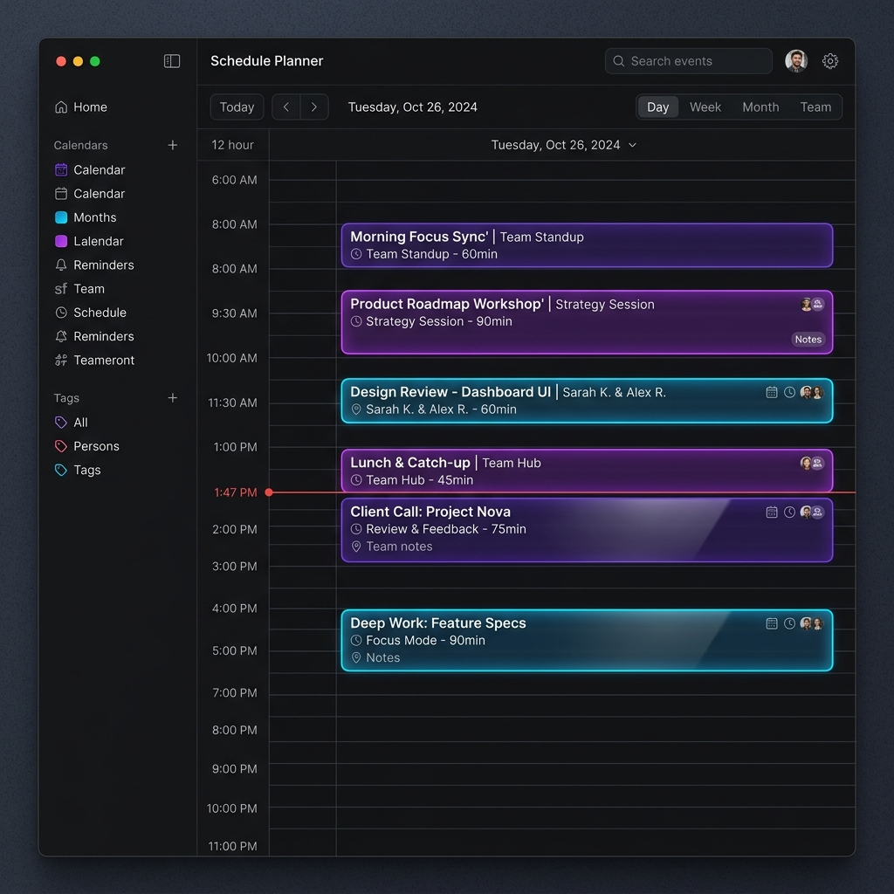
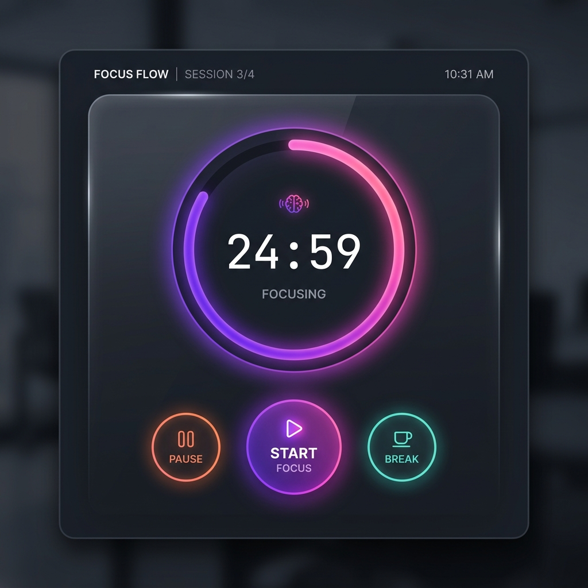
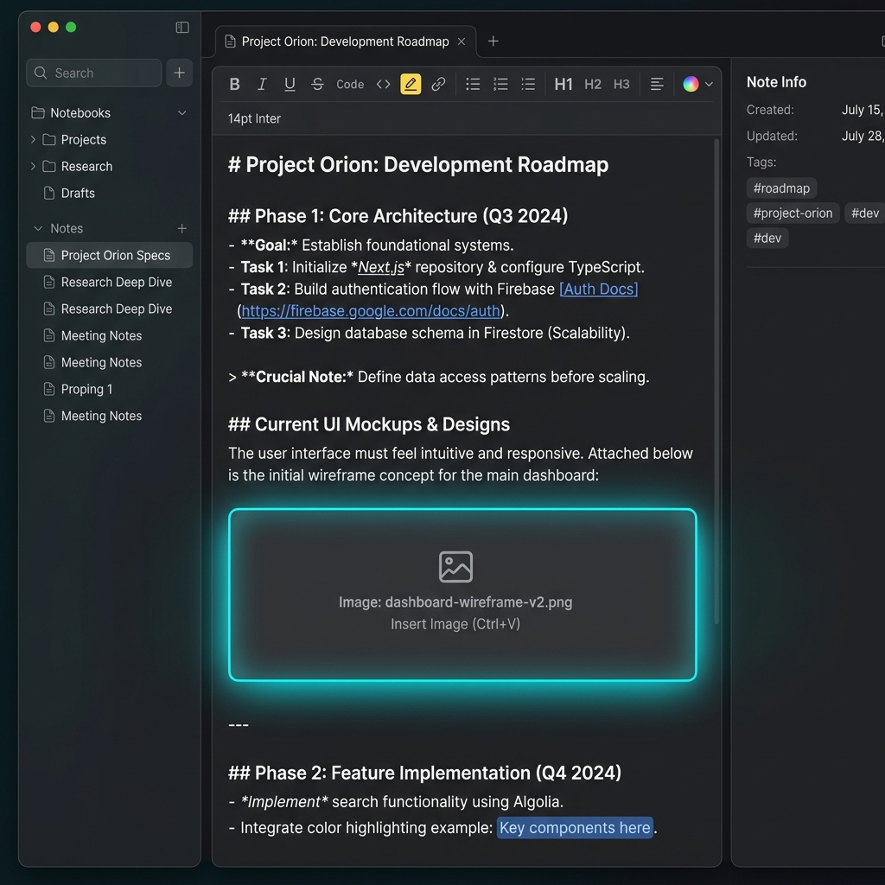
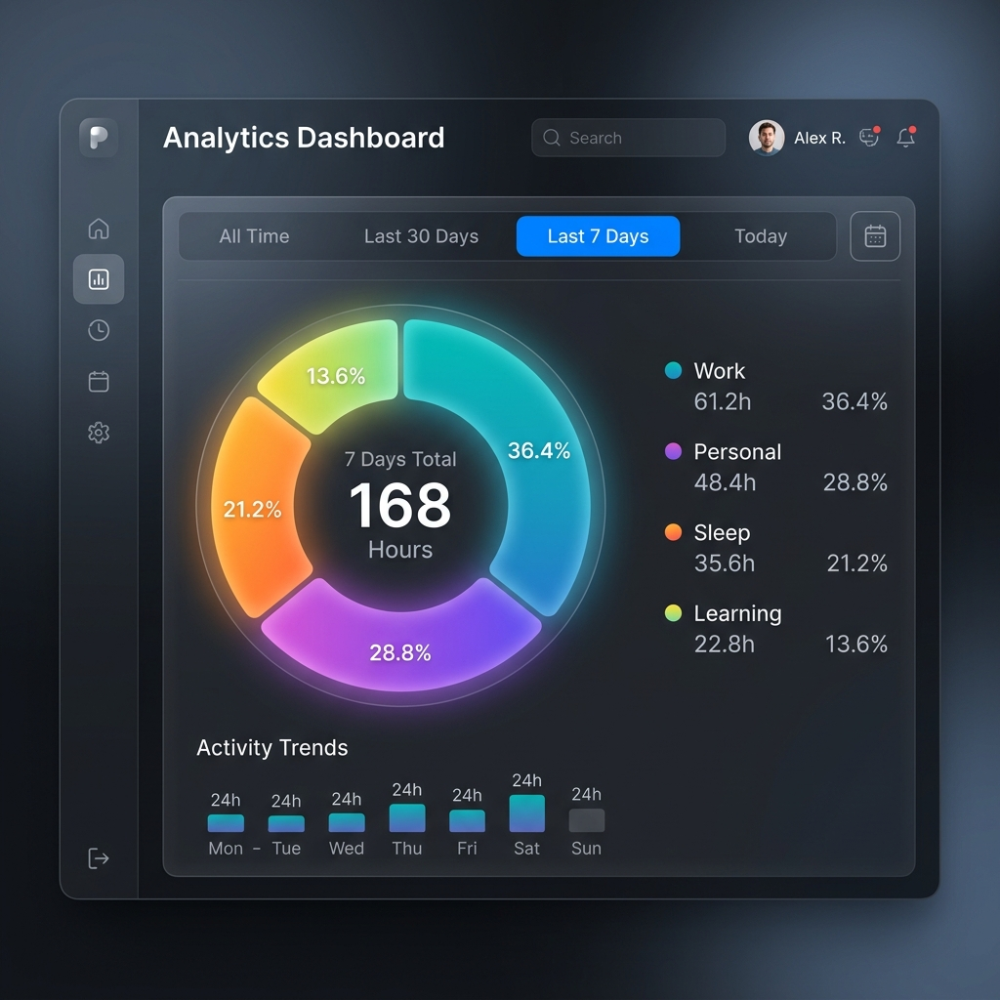
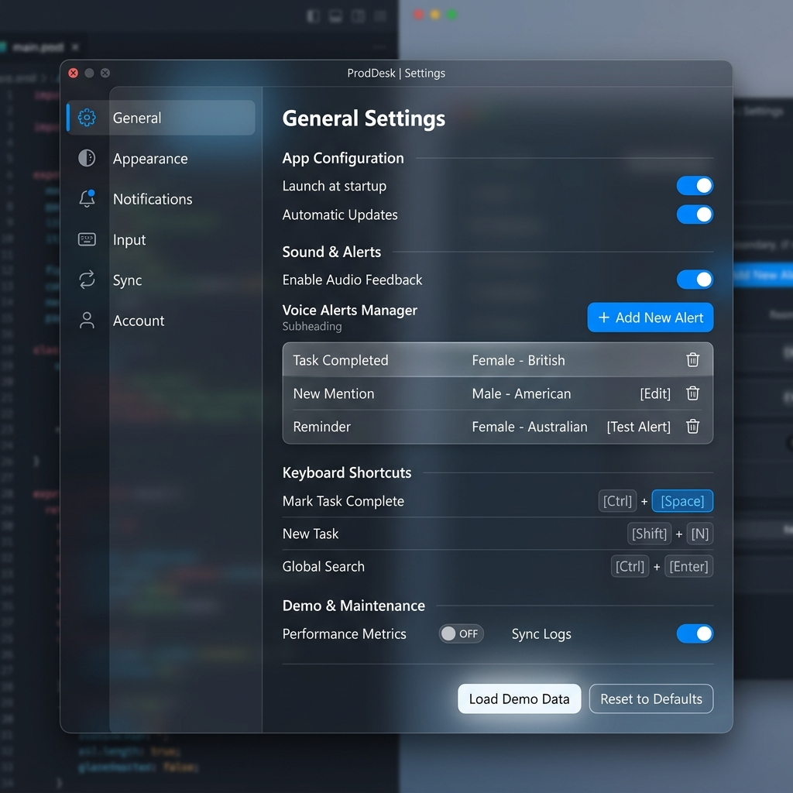

# Orb Productivity Tracker (Orb OS)

> A premium, futuristic desktop productivity operating system designed for goals, tasks, scheduling, voice reminders, breaks, and deep focus sessions.

Orb OS is a desktop application built to streamline your daily workflows, help you stick to goals, manage events, and track breaks. Designed with a dark glassmorphism aesthetic and a focus on premium user experience, Orb OS offers an immersive productivity dashboard.

---

## 🌌 Offline-First Philosophy

Orb OS operates entirely locally on your machine. Your goals, logs, settings, and notes are written to an offline JSON database inside your application data directory.
* **100% Privacy**: No data is transmitted to external servers.
* **No Accounts Required**: Start tracking immediately after installation.
* **High Availability**: Fully functional without an active internet connection.

---

## ✨ Features

* **Consolidated Timer**: Toggle between a Focus Timer (with circular Pomodoro, Deep Work, and Stopwatch tracking) and a Break Tracker (to log break allowance).
* **Kanban Task Board**: Group, sort, filter, and drag-and-drop tasks. Customize categories with beautiful color circles.
* **Schedule Planner**: Plan your day in a vertical hourly grid. Supports both 12-hour (AM/PM) and 24-hour time formatting.
* **Voice Reminders & Aura System**: Ambient voice system notifies you of strict reminders. Control focus states using system hotkeys.
* **Rich Notes Workspace**: Fully functional text workspace with URL link embedding, image attachment, and custom text coloring/highlighting.
* **Interactive Analytics**: Conic-gradient donut charts illustrating time distribution across categories, filterable by time ranges.
* **System Tray integration & Hotkeys**: Seamlessly runs in the background and responds to keyboard shortcuts:
  * `Ctrl+Shift+F`: Toggle Aura state
  * `Ctrl+Shift+T`: Start focus session
  * `Ctrl+Shift+B`: Start break
  * `Ctrl+Shift+N`: Open quick note entry
  * Custom loop dismissal key (default `D`) configured via Settings.

---

## 🎨 Screenshots

To give you a preview of the user interface:

| Dashboard | Goals Grid |
| :---: | :---: |
|  |  |

| Kanban Board | Schedule Planner |
| :---: | :---: |
|  |  |

| Focus Timer | Notes Workspace |
| :---: | :---: |
|  |  |

| Analytics Donut | Settings Panel |
| :---: | :---: |
|  |  |

---

## 🛠️ Tech Stack

* **Frontend Framework**: [React 19](https://react.dev/) + [TypeScript 6](https://www.typescriptlang.org/)
* **Build System**: [Vite 8](https://vite.dev/)
* **Shell Wrapper**: [Electron 42](https://www.electronjs.org/)
* **Styling**: Modern Vanilla CSS with custom animations, CSS variables, and glassmorphism.
* **Icons**: [Lucide React](https://lucide.dev/)

---

## 🚀 Installation & Setup

### Prerequisites

You need [Node.js](https://nodejs.org/) (v18 or higher recommended) and npm installed.

### 1. Clone the repository

```bash
git clone https://github.com/username/orb-os.git
cd orb-os
```

### 2. Install dependencies

```bash
npm install
```

### 3. Run in Development Mode

Launch the Vite development server and the Electron application:

```bash
# Terminal 1: Start Vite Dev Server
npm run dev

# Terminal 2: Start Electron
npm run electron
```

### 4. Build the Application

Compile the TypeScript assets and build the client:

```bash
npm run build
```

---

## 📦 Packaging & Releases

Orb OS is configured for local packaging into standalone desktop installers using `electron-builder`.

### Windows Release (`.exe` Installer)
To compile a Windows installer:
```bash
npm run package:win
```
The output executable will be created in the `dist-electron/` folder.

### macOS Release (`.dmg` Installer)
To compile a macOS installer:
```bash
npm run package:mac
```
The output `.dmg` volume will be created in the `dist-electron/` folder.

---

## 📄 Open-Source Notice

This project is licensed under the [MIT License](LICENSE). Contributions, bug reports, and suggestions are welcome.
